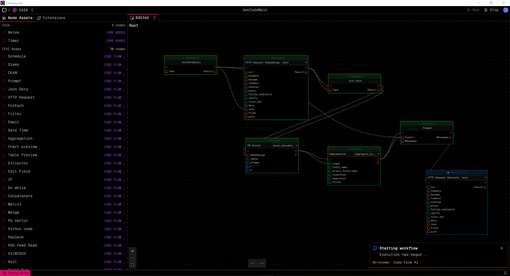
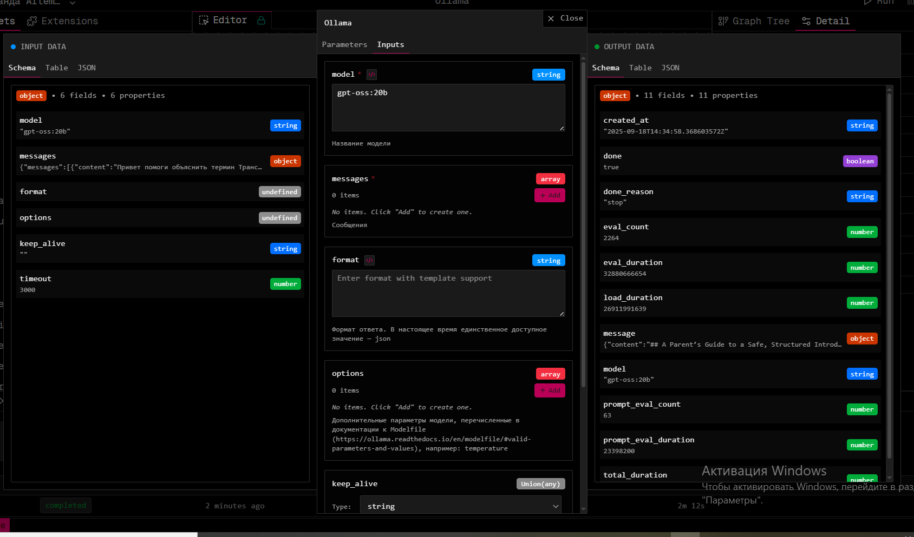
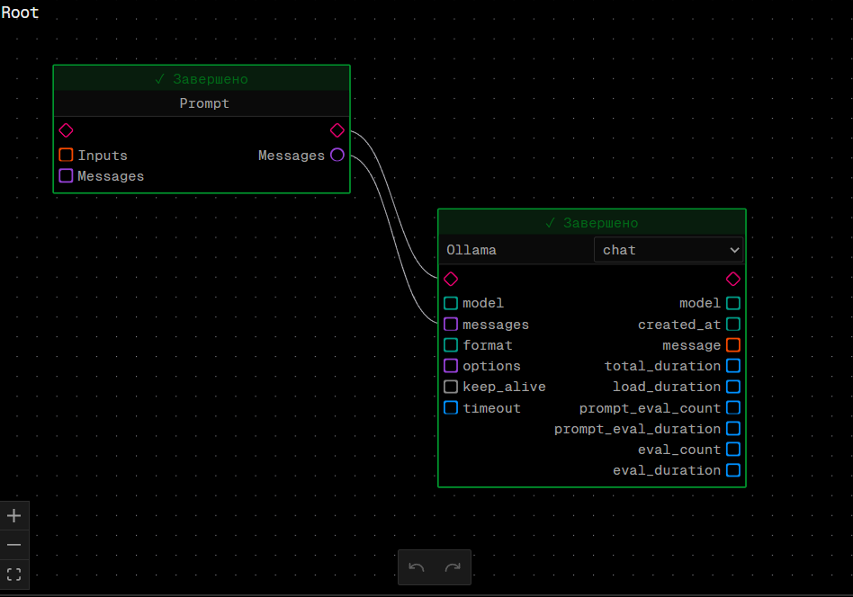
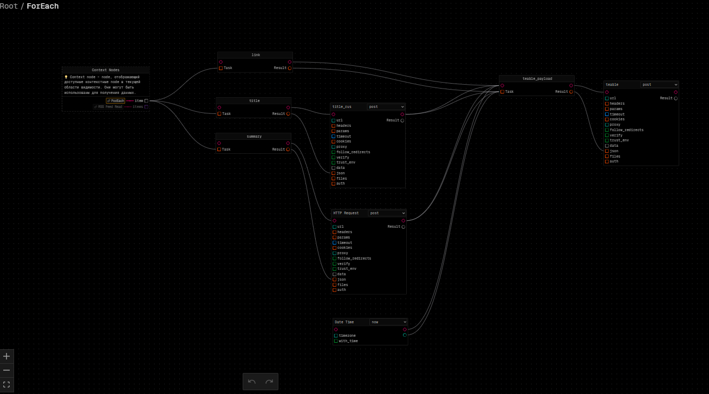
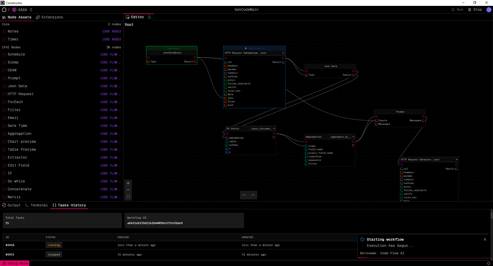
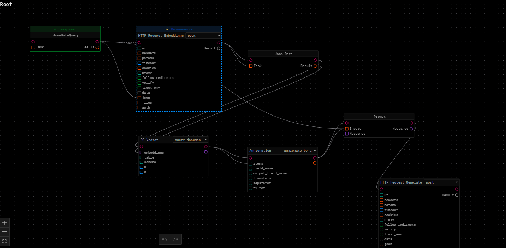
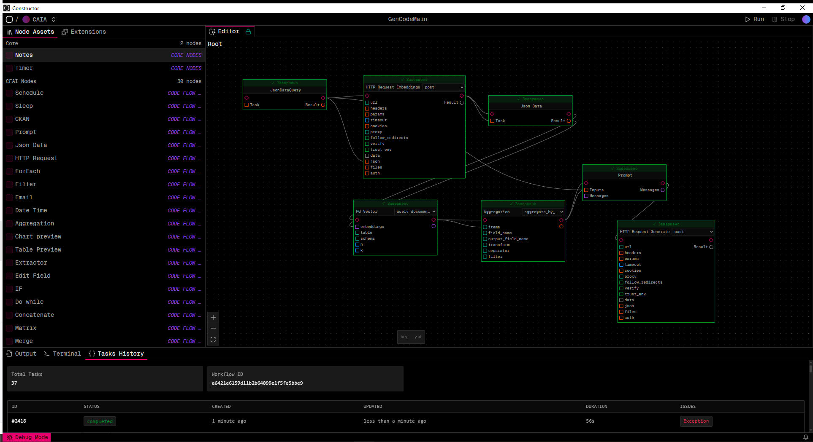

# Руководство пользователя

## Глоссарий

| Термин | Определение |
|----|----|
| Рабочий процесс (workflow) | Последовательный запуск действий из доступного набора |
| Нода (node) | Базовая единица действия в workflow |
| Контекст  (Context) | Данные, доступные в текущей области видимости |
| Параметр (Parameters) | Статическая настройка ноды |
| Вход/ Выход (Input/Output) | Динамические порты данных |
| Холст (Canvas) | Рабочая область для построения workflow |
| Соединение (Connection) | Связь между нодами для передачи данных |
| Шаблон (Template) | Формат для передачи данных между нодами `{{node.field}}` |
| Цикл (Loop) | Повторяющееся выполнение нод (ForEach, DoWhile) |
| Условие (Condition) | Логическое выражение для ветвления (If, Switch) |

## Начало работы

### Интерфейс системы

Система AI Constructor предоставляет визуальный интерфейс для создания рабочих процессов:

* **Панель нод** - библиотека доступных действий
* **Холст** - рабочая область для построения workflow
* **Панель свойств** - настройка выбранной ноды
* **Панель результатов** - просмотр выполнения и результатов

### Создание нового workflow


1. **Нажмите "Create +"** в разделе Projects команды
2. Введите имя проекта
3. Выберите расширение Code
4. **Введите название** и описание процесса
5. **Начните добавлять ноды** из панели слева

## Правила построения рабочего процесса

### Основные принципы


1. **Логика передачи данных и управления потоком разделены** - данные передаются через соединения, управление через последовательность выполнения
2. **Связи между нодами** представлены шаблонами типа `{{node_uuid.output_key}}`
3. **Динамическая подстановка** значений параметров во время выполнения
4. **Параллельное выполнение** нод без зависимостей

### Порядок выполнения

Система автоматически определяет порядок выполнения нод:


1. **Запускаются ноды без родителей** - действия без зависимостей от других нод
2. **Затем запускаются потомки** выполненных нод
3. **Параллельно выполняются** ноды, готовые к запуску
4. **При ошибке система повторяет** выполнение до 3 раз

### Построение графа


1. **Располагайте ноды слева направо** - это упрощает понимание потока данных
2. **Соединяйте ноды стрелочками** - указывайте порядок выполнения
3. **Группируйте связанные ноды** - используйте логические блоки

 

### Ограничения

* **Без циклов** - система не поддерживает циклические зависимости
* **Без управления состоянием** - каждая нода выполняется независимо
* **Обработка ошибок** - при ошибке workflow останавливается после 3 попыток
* **Один одновременно запущенный процесс в рамках одного проекта**
* **Одно возможное расписание**  **в рамках одного проекта**

## Работа с нодами

### Добавление нод на холст


1. **Найдите нужную ноду** в панели нод
2. **Перетащите ноду** на холст
3. **Расположите ноду** в удобном месте

### Настройка ноды


1. **Выберите ноду** на холсте (кликните на неё)
2. **Откройте панель свойств** (двойной клик или кнопка "Настройки")
3. **Заполните параметры**:
   * **Метод** - выберите режим работы ноды
   * **Параметры** - статические настройки
   * **Входные данные** - динамические значения

 

### Соединение нод


1. **Наведите курсор** на выходной порт ноды (круг)
2. **Перетащите линию** к входному порту другой ноды (квадрат)
3. **Отпустите кнопку мыши** для создания соединения

 

### Передача данных между нодами

В настройках ноды используйте шаблоны для получения данных от других нод:

* `{{имя_ноды}}` - весь результат ноды
* `{{имя_ноды.поле}}` - конкретное поле результата
* `{{имя_ноды.[0]}}` - первый элемент списка
* `{{имя_ноды.поле.[0]}}` - поле первого элемента списка

**Примеры:**

```
{{rss_read}}                    # Весь результат
{{rss_read.title}}              # Поле title
{{rss_read.items.[0]}}          # Первый элемент списка
{{rss_read.items.[0].title}}    # Title первого элемента
```

## Типы нод

### Обычные ноды

Выполняют одну операцию с данными:

* **HTTPRequestNode** - HTTP запросы к внешним API
* **DateTimeNode** - работа с датой и временем
* **JSONDataNode** - обработка и создание JSON данных
* **PythonCodeNode** - выполнение пользовательского Python кода
* **RssFeedReadNode** - чтение RSS лент
* **FilterNode** - фильтрация данных по условиям

### Ноды управления потоком

#### IfNode - Условное выполнение

Позволяет выполнять разные ветки workflow в зависимости от условия:


1. **Добавьте IfNode** на холст
2. **Настройте условие** в панели свойств
3. **Соедините выходы** с разными нодами для true/false случаев

#### SwitchNode - Множественный выбор

Выполняет одну из нескольких веток в зависимости от значения:


1. **Добавьте SwitchNode** на холст
2. **Настройте правила** для каждого случая
3. **Соедините выходы** с соответствующими нодами

### Ноды циклов

Внутренний граф нод доступен через Shift+leftClick по названию ноды

 

#### ForEachNode - Цикл по списку

Обрабатывает каждый элемент списка:


1. **Добавьте ForEachNode** на холст
2. **Подключите список** к входу "items"
3. **Настройте внутренние ноды** для обработки каждого элемента
4. **Выберите режим выполнения**: синхронный или асинхронный

#### DoWhileNode - Цикл с условием

Повторяет выполнение до выполнения условия выхода:


1. **Добавьте DoWhileNode** на холст
2. **Настройте условие выхода** и максимальное количество итераций
3. **Добавьте ноды** для выполнения в цикле

## Запуск и мониторинг

### Запуск workflow


1. **Нажмите кнопку "Run"** в верхней панели интерфейса
2. **Дождитесь уведомления** о старте процесса
3. **Наблюдайте выполнение** - ноды подсвечиваются по мере выполнения

 

### Мониторинг выполнения

Во время выполнения workflow:

* **Ноды подсвечиваются** в порядке выполнения
* **Статус отображается** в реальном времени
* **Ошибки показываются** с подробным описанием
* **Прогресс выполнения** виден на холсте

 

### Просмотр результатов

После выполнения workflow доступны:


1. **TaskHistory** - список выполненных задач с ID, статусом и временем
2. **Output** - логи выполнения для отладки
3. **Результаты нод** - доступны через двойной клик на ноду

 

## Практические примеры

### Пример 1: Обработка RSS ленты

Создайте workflow для чтения и обработки новостей:


1. **Добавьте RssFeedReadNode** - для чтения RSS ленты
2. **Настройте URL** ленты в параметрах ноды
3. **Добавьте ForEachNode** - для обработки каждой новости
4. **Внутри цикла добавьте**:
   * DateTimeNode - для получения текущей даты
   * HTTPRequestNode - для обработки текста через AI
   * JSONDataNode - для формирования результата

**Правила построения:**

* Расположите ноды слева направо
* Соедините RssFeedReadNode с ForEachNode
* Настройте передачу данных через шаблоны `{{rss_read.result}}`

### Пример 2: Условная обработка данных

Создайте workflow с ветвлением:


1. **Добавьте HTTPRequestNode** - для получения данных
2. **Добавьте IfNode** - для проверки условия
3. **Настройте условие** (например, количество элементов > 10)
4. **Соедините выходы** с разными нодами обработки

### Пример 3: Циклическая обработка

Создайте workflow с повторением:


1. **Добавьте DoWhileNode** - для циклического выполнения
2. **Настройте условие выхода** (например, достижение определенного результата)
3. **Добавьте ноды** для выполнения в цикле
4. **Установите максимальное количество итераций** для безопасности

## Советы и рекомендации

### Лучшие практики


1. **Используйте понятные имена** для нод и workflow
2. **Располагайте ноды слева направо** для лучшего понимания потока
3. **Группируйте связанные ноды** визуально
4. **Тестируйте workflow** на небольших данных перед полным запуском

### Отладка


1. **Проверяйте соединения** между нодами
2. **Используйте JSONDataNode** для просмотра промежуточных результатов
3. **Анализируйте логи** в окне Output при ошибках
4. **Тестируйте ноды по отдельности** перед объединением в workflow

## Типичные ошибки и решения

### Ошибки построения workflow

**Проблема:** Циклические зависимости

* **Решение:** Проверьте, что нода A не зависит от ноды B, которая зависит от A

**Проблема:** Нода не получает данные

* **Решение:** Проверьте правильность шаблонов `{{node_name.field}}`

**Проблема:** Workflow зависает

* **Решение:** Убедитесь, что все ноды имеют выходы и нет тупиковых веток

### Ошибки выполнения

**Проблема:** Нода завершается с ошибкой

* **Решение:** Проверьте входные данные и параметры ноды

**Проблема:** Неправильный формат данных

* **Решение:** Используйте JSONDataNode для преобразования данных

**Проблема:** Таймаут выполнения

* **Решение:** Увеличьте таймаут для нод с долгим выполнением